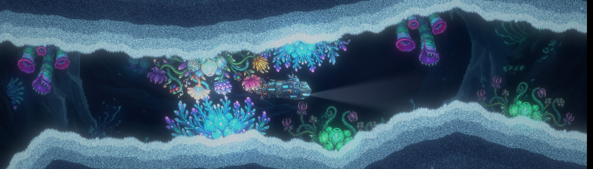
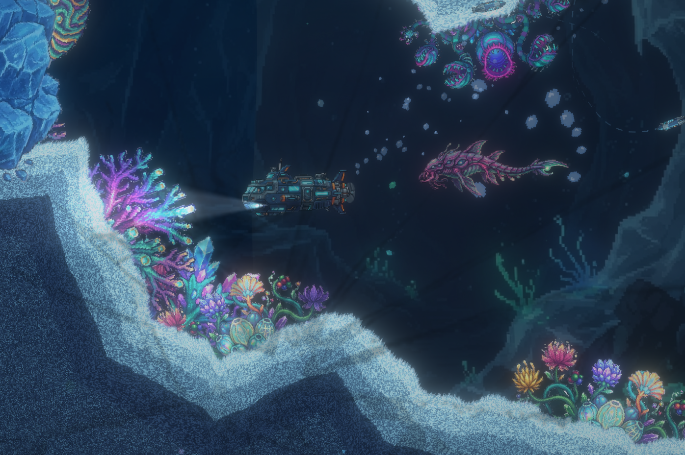
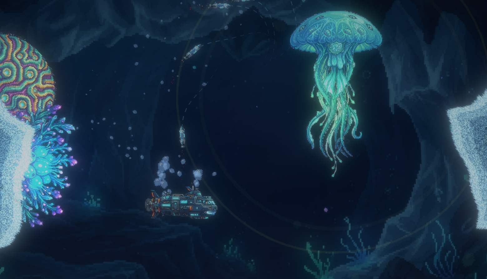
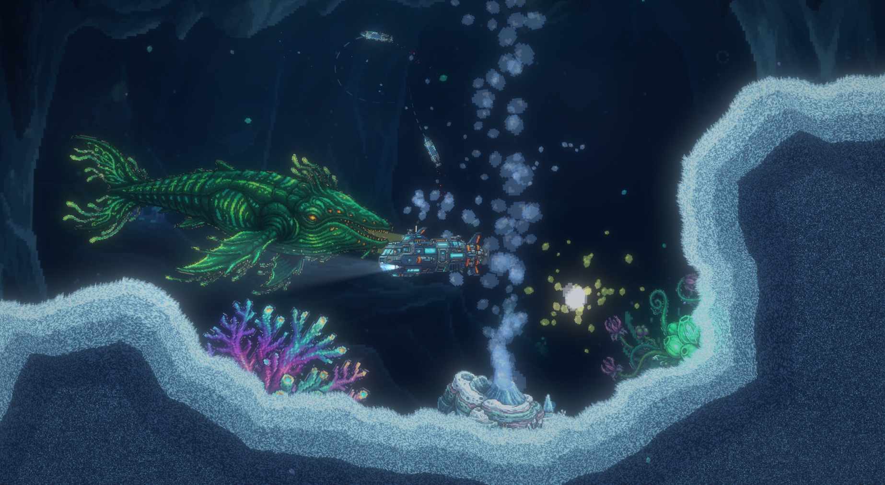
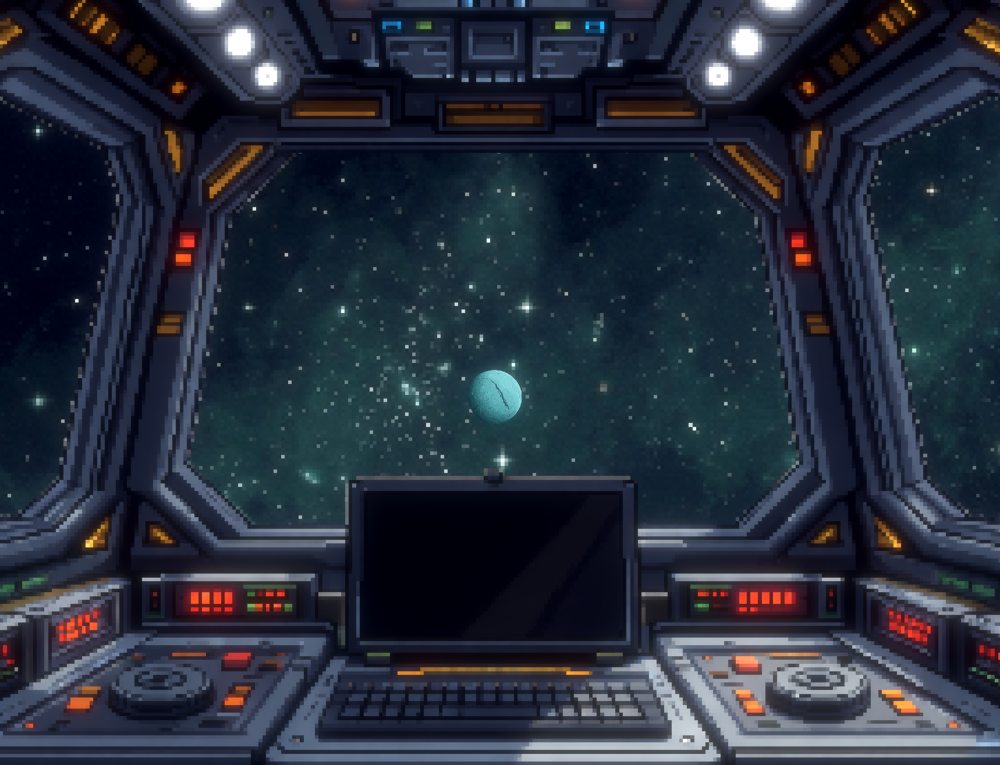

# Cry from Haumea ([Play online here!](https://brutenis.net/haumea))

You decide to rush to help a missing pilot, upon receiving an SOS message requesting help on the dwarf planet Haumea in the Kuiper Belt. Can you find him?

A side-scroller where you control a submarine with a torpedo attack, fighting four different aliens with varying attack patterns. The game has multiple intro and outro cutscenes and has a conclusive ending. The story focuses on finding the missing pilot and figuring out what happened to him. Can you save him?

This game was created as part of the [Oster-Game Jam MV 2026](https://mv-gamejam.de/) in 48 hours.

## Credits

The game was created by Jule Engel and Brutenis Gliwa, with some help for the music by Justin Kreikemeyer.

* Addons:
  * [SmartShape2D](https://github.com/SirRamEsq/SmartShape2D) for the terrain

* Font: [Orbitron](https://fonts.google.com/specimen/Orbitron)

* Music:
  * "Welcome to Haumea" by Justin Kreikemeyer, CC-BY-NC-SA 4.0
  * [nickpanekaiassets-epic-synthwave-combat-music-253078.mp3](https://cdn.pixabay.com/download/audio/2024/10/20/audio_e30018b9a8.mp3?filename=nickpanekaiassets-epic-synthwave-combat-music-253078.mp3)
  * [fidelfortune-cyberpunk-synthwave-351505.mp3](https://cdn.pixabay.com/download/audio/2025/05/29/audio_7292c86bf3.mp3?filename=fidelfortune-cyberpunk-synthwave-351505.mp3)

* Sound effects:
  * [liecio-old-internet-modem-dialing-189735.mp3](https://cdn.pixabay.com/download/audio/2024/02/05/audio_6d0192df01.mp3?filename=liecio-old-internet-modem-dialing-189735.mp3)
  * [freesound_community-rocket-landing-38715.mp3](https://cdn.pixabay.com/download/audio/2022/03/10/audio_69e1b85292.mp3?filename=freesound_community-rocket-landing-38715.mp3)
  * [dragon-studio-glass-cracking-511310.mp3](https://cdn.pixabay.com/download/audio/2026/03/30/audio_f5fc23a5ad.mp3?filename=dragon-studio-glass-cracking-511310.mp3)
  * [dragon-studio-shattering-ice-454251.mp3](https://cdn.pixabay.com/download/audio/2025/12/19/audio_dad43c820a.mp3?filename=dragon-studio-shattering-ice-454251.mp3)
  * [49053354-rocket-launch-306441.mp3](https://cdn.pixabay.com/download/audio/2025/02/26/audio_febae8992b.mp3?filename=49053354-rocket-launch-306441.mp3)
  * [freesound_community-demon-growl-for-halloween-spooky-creepy-scary-monster-ghoul-ghost-sounds-100123.mp3](https://cdn.pixabay.com/download/audio/2022/03/24/audio_2e4e86cfbe.mp3?filename=freesound_community-demon-growl-for-halloween-spooky-creepy-scary-monster-ghoul-ghost-sounds-100123.mp3)
  * [freesound_community-monster-sound-2-86239.mp3](https://cdn.pixabay.com/download/audio/2022/03/15/audio_83af84c4d2.mp3?filename=freesound_community-monster-sound-2-86239.mp3)
  * [bannythecoolio-impactful-damage-425132.mp3](https://cdn.pixabay.com/download/audio/2025/10/24/audio_b864cc9e3b.mp3?filename=bannythecoolio-impactful-damage-425132.mp3)
  * [fnx_sound-futuristic-alien-oscillation-287324.mp3](https://cdn.pixabay.com/download/audio/2025/01/13/audio_b0a8097730.mp3?filename=fnx_sound-futuristic-alien-oscillation-287324.mp3)
  * [fnx_sound-alien-alert-noise-287332.mp3](https://cdn.pixabay.com/download/audio/2025/01/13/audio_9fd3e784b4.mp3?filename=fnx_sound-alien-alert-noise-287332.mp3)
  * [fnx_sound-alien-underworld-sound-287342.mp3](https://cdn.pixabay.com/download/audio/2025/01/13/audio_7879067bc8.mp3?filename=fnx_sound-alien-underworld-sound-287342.mp3)
  * [dragon-studio-alien-sounds-463202.mp3](https://cdn.pixabay.com/download/audio/2026/01/08/audio_802dcca6bd.mp3?filename=dragon-studio-alien-sounds-463202.mp3)
  * [dragon-studio-cinematic-dive-underwater-467471.mp3](https://cdn.pixabay.com/download/audio/2026/01/16/audio_4cff38a0a9.mp3?filename=dragon-studio-cinematic-dive-underwater-467471.mp3)
  * [dragon-studio-engine-rumble-482867.mp3](https://cdn.pixabay.com/download/audio/2026/02/10/audio_16e4982b4c.mp3?filename=dragon-studio-engine-rumble-482867.mp3)
  * [dragon-studio-deep-sea-underwater-ambience-482888.mp3](https://cdn.pixabay.com/download/audio/2026/02/10/audio_b1345942ff.mp3?filename=dragon-studio-deep-sea-underwater-ambience-482888.mp3)
  * [freesound_community-duoi-mat-bien-43603.mp3](https://cdn.pixabay.com/download/audio/2022/03/10/audio_2a1394356f.mp3?filename=freesound_community-duoi-mat-bien-43603.mp3)
  * [dragon-studio-water-splash-effect-443133.mp3](https://cdn.pixabay.com/download/audio/2025/11/26/audio_0267789f35.mp3?filename=dragon-studio-water-splash-effect-443133.mp3)
  * [freesound_community-deep-sea-ambience-6933.mp3](https://cdn.pixabay.com/download/audio/2021/08/09/audio_24d84f97b9.mp3?filename=freesound_community-deep-sea-ambience-6933.mp3)
  * [freesound_crunchpixstudio-attack-release-384909.mp3](https://cdn.pixabay.com/download/audio/2025/08/05/audio_81673909f2.mp3?filename=freesound_crunchpixstudio-attack-release-384909.mp3)
  * [dragon-studio-large-underwater-explosion-423651.mp3](https://cdn.pixabay.com/download/audio/2025/10/21/audio_917d7ec41c.mp3?filename=dragon-studio-large-underwater-explosion-423651.mp3)
  * [freesound_community-swim-44183.mp3](https://cdn.pixabay.com/download/audio/2022/03/10/audio_ca9951e27e.mp3?filename=freesound_community-swim-44183.mp3)
  * Coin pickup, generated via [sfxr.me](https://sfxr.me)

